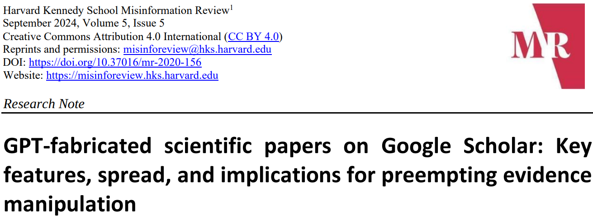
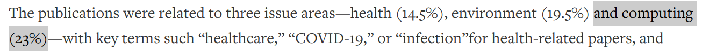
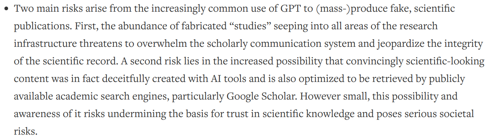

+++

title = "Reproducible experiments or didn't happen"
description = "The replicability crisis and recipes for self-organizing systems"
outputs = ["Reveal"]
aliases = [
    "/guide/"
]

+++

# PhD forum talk @ ACSOS 2024

#### {}
## [Danilo Pianini](mailto:danilo.pianini@unibo.it)
### Alma Mater Studiorum -- Università di Bologna

---


                       

<!-- white background -->

source: https://www.earth.com/news/hippopotamus-population-hit-hard-by-habitat-destruction

---

# Hippos (Hippopotamus amphibius) facts

* {}
* {}
* {}
* {}
* {}

---

I'm now making a claim, and I want to see if you believe me

{}
# An adult hippo's bite can crush in half an adult crocodile

Please *raise your hand if you believe this claim*
{}

{}

Please raise your hand if you believe this claim *now*
{}

---

---

Let's do the same game

{}
# Humans can tame and ride hippos

Please *raise your hand if you believe this claim*
{}

{}

Please raise your hand if you believe this claim *now*
{}

{}
Would it be more convincing if I precisely explained how the hippo was tamed and ridden?
{}

{}
Would it be more convincing if multiple independent people applied the same procedure and obtained the same result?
{}

---

# ~~Picture~~ Reproducible experiments, or didn't happen

<small>AI didn't like the letter R</small>

---

---

## Replication crisis
### aka replicability crisis or reproducibility crisis

* ongoing *methodological crisis*
* the results of many scientific studies are hard or impossible to *reproduce*.

* empirical reproductions are essential for the the scientific method

#### no reproducibility $\Rightarrow$ scientific credibility is undermined

---

{}{}
{}{}

---

## The good news: people working in computer science are lucky!
#### (on average)

* It's the only engineering discipline producing *mass-less* artifacts
    * Much easier to *share*
* Even if we work in highly unpredictable contexts, we can *control randomness* in many experiments
    * Much easier to *reproduce*
* We have support tools to *track changes*, *automate*, and *manage* complexity
    * Much easier to *maintain*

---

## Develop and share your tool or experiment, checklist

1. Set up a *version control system*
2. Prepare a code *repository*
3. Set up a *build automation* system
4. Make sure you can *control randomness*
5. Work in isolation using *containers*
6. Raise your confidence with *continuous integration* and *continuous delivery*
7. Pick a good *license*
9. *Document* your work

---

# Version Control Systems

1. Keeps track of changes
2. Fosters collaboration
3. Foundational tool for sharing through well-known source code hosting platforms

{}
{}
## Dos
* set it up early to support the construction of the artifact
* `git` is a standard de-facto, use it
* track only non-generated files $\Rightarrow$ set up and maintain a good `.gitignore`
* take your time to understand how to *solve conflicts*
* learn the basics using a terminal
{}
{}
## Don'ts
* start using it when it is time to share the artifact
* pick niche and/or declining tools (even if they are good -- `hg`, `svn`...)
* paste commands / fiddle with UIs without understanding what you are doing
* delete the repo and start over
{}
{}
## Advanced
* Use it for the paper, too, if you write in $\LaTeX$
* Agree on a branching strategy with your collaborators
* Learn `rebase`, `bisection`, `cherry-pick`, and other advanced features
{}
{}

---

# Public code repositories

1. The place where others will search for your code
    * Especially if it is a **tool** or a **library**
2. Fosters collaboration
3. Provide many useful ancillary services
    * Issue tracking
    * Continuous integration
    * Documentation hosting

{}
{}
## Dos
* prefer cloud-hosted repositories to on-premise ones
* if you can, use [GitHub](https://github.com) <i class="fa-brands fa-github"></i>
* a reasonable niche alternative is [GitLab](https://gitlab.com) <i class="fa-brands fa-gitlab"></i>
* prepare a good `README.md` file to guide users
{}
{}
## Don'ts
* share only through your institutional website, unless you are forced to
* upload archives instead of code, it's not a 1990s FTP server
{}
{}
## Advanced
* use *pull requests* to contribute upstream or integrate changes if it is a long-lived project
* investigate the *additional services*, e.g., bots that propose dependency updates
{}
{}

---

# Build automation

1. Automatic fetch and download of software dependencies
2. Automatic compilation and packaging
3. Automatic testing
4. Automatic execution of the experiments

{}
{}
## Dos
* pick tools based on the language/ecosystem *favoring those most used* in the development community
    * Java / Kotlin $\Rightarrow$ Gradle
    * JavaScript $\Rightarrow$ npm
    * Python $\Rightarrow$ poetry
* strive to have *a single short command* on a freshly cloned copy run the entire experiment
or test and pack the tool
* minimize the pre-requirements
{}
{}
## Don'ts
* require manual steps
* rely on dependencies not available in mainstream repositories
* require an *IDE* to run the experiments
{}
{}
## Advanced
* use the build tool to install the toolchains, if possible (see e.g., the Gradle Toolchains)
* build a one-command, zero-setup demo, e.g.:
    * `curl -sL https://bit.ly/dais-2023-loadshift | bash`
{}
{}

Example: https://github.com/angelacorte/vmc-experiments

---

# Control randomness

1. Obtain the same *exact* results when running the same experiment
2. When building a tool or library, make sure that the same input produces the same output

{}
{}
## Dos
* always *seed* your pseudo-random number generator
* when modeling a random process, always expose an *API* to set the seed
* when interacting with the real-world, use *mocks* or *stubs*
(there are many great testing libraries that provide them)
{}
{}
## Don'ts
* call `Math.random()`, `random.randint`, `rand()` or similar functions
{}
{}
## Advanced
* In case of unavoidable randomness, e.g., due to *parallelism*,
provide a *companion experiment* (smaller in size) that can be executed deterministically
{}
{}

---

# Isolation and self-containment via containers

1. It runs on your machine? Ship your machine!
2. Easy to share lightweight virtual machines (NOTE: they are not VMs)
3. They apply to **experiments**, much less to **tools**

{}
{}
## Dos
* prepare one or more `Dockerfile`s packing your experiment and all its dependencies
* prefer *containers over setup instructions* for clients
* publish your images on a public registry (e.g., *dockerhub*)
{}
{}
## Don'ts
* mount and write into user-local folders with the `root` user
* until they allow access without a token, avoid GitHub's `ghcr.io` registry
{}
{}
## Advanced
* Use orchestrators such as `docker-compose` to manage complex setups
{}
{}

Example: https://github.com/nicolasfara/experiments-2024-ACSOS-imageonomics-drones

---

# Continuous integration and continuous delivery

1. For each change, automatically run a verification process
2. Easy to share lightweight virtual machines (NOTE: they are not VMs)

{}
{}
## Dos
* set up the *CI/CD pipeline* as soon as possible
    * most code hosting platforms provide it for free within limits
* rely on the *build process* that you set up before
* *deliver* the artifacts automatically if the verification succeeds
* produce a *reduced version* of the experiments that can serve *testing purposes* and can be used as *quick demo*
{}
{}
## Don'ts
* run the *whole experiments* in the pipeline even if they take hours
{}
{}
## Advanced
* automatically deal with updates and patches using a *automatic merging rules* for PRs
* automatically release new versions (checkout [Semantic Release](https://github.com/semantic-release/semantic-release))
{}
{}

Example: https://github.com/nicolasfara/experiments-2024-acsos-multi-tier-field-based-applications

---

# Pick a license

1. Unlicensed software is [proprietary](https://choosealicense.com/no-permission/)
    * the copyright exsists even if you don't write it, unless you *explicitly renounce* to part of it
2. Pick the right license for the job, depending on your goals

{}
{}
## Dos
* use a *standard license* (e.g., MIT, Apache, GPL, LGPL)
* check what your license allows and what it does not
{}
{}
## Don'ts
* concoct your own license
    * exception: adding a *linking/classpath exception* to the GPL
* use a *funny* license, such as Beerware or WTFPL
{}
{}

## Rules of thumb
* if people to do whatever they want to, use *MIT* or *BSD*
* if you want to track contributions or protect trademarks, use *Apache 2.0*
* *do not use GNU LGPL* if you want companies to use your library
    * forces the linking software to be partly reverse-engineerable
    * a *GNU GPL with linking/classpath exception* is more permissive
* if you wanto to be protective and force everyone using your stuff to release theirs,
    use *GNU GPL*
* if your software is networked, consider *GNU Affero* in place of *GNU GPL*
* *do not use Creative Commons licenses for software*
* for any detailed use, *ask your legal team*

---

# Archival copies and digital object identifiers

1. Don't let your software disappear
2. Let other reference specific versions of your software through a DOI

{}
{}
## Dos
* connect GitHub to an archival service, e.g., [Zenodo](https://zenodo.org)
    * every GitHub release will be *automatically archived* and *assigned a DOI*
* Use services such as [DOI2bib](https://doi2bib.org/) to get a BibTeX entry for your DOI
    * *Clean it up* if you use bots, or they'll appear as coauthors
{}
{}
## Don'ts
* upload software manually to archives
{}
{}
## Advanced
* treat your documentation as you treat your software: *version it*, *review it*, *test it*
* configure the *CI/CD pipeline* to automatically build and deploy the documentation
{}
{}

Example: https://github.com/anitvam/dsrt-2024-jakta-alchemist $\Rightarrow$ 

---

# Document your work

1. Help other people understand your work
2. Help other people build on your work

{}
{}
## Dos
* pick a framework to better organize your documentation
    * I recommend the [DIVIO documentation system](https://docs.divio.com/documentation-system/)
* leverage [GitHub Pages](https://pages.github.com/) or similar services to host your documentation
    * with every organization, you get a free static website `https://<org>.github.io/`
    * you get one with every repository, too, at `https://<username>.github.io/<repository>`
* use a *static site generator* (e.g., [Hugo](https://gohugo.io/), [Jekyll](https://jekyllrb.com/))
to convert Markdown documentation into a website
{}
{}
## Don'ts
* use HTML/js/CSS directly, it's hard to *maintain*
{}
{}
## Advanced
* treat your documentation as you treat your software: *version it*, *review it*, *test it*
* configure the *CI/CD pipeline* to automatically build and deploy the documentation
{}
{}

Example: https://alchemistsimulator.github.io/

---

# Conclusion

* {} Make sure *others can reproduce* your experiments {}
* {} Lower the *maintenance burden* of your tools by using *DevOps techniques* {}
    * {} Version Control {}
    * {} Build Automation {}
    * {} Containerization {}
    * {} CI/CD {}
* {} Upload your artifacts *where others are likely to search* for them {}
* {} Make your experiment *future-proof* by archiving os software-preservation platforms {}
* {} Don't forget to *apply a license* {}

---

### And of course, **don't try to tame and ride a hippo**

