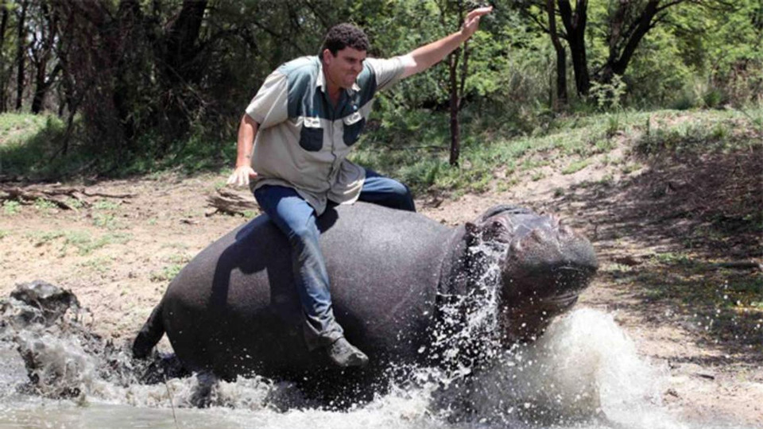
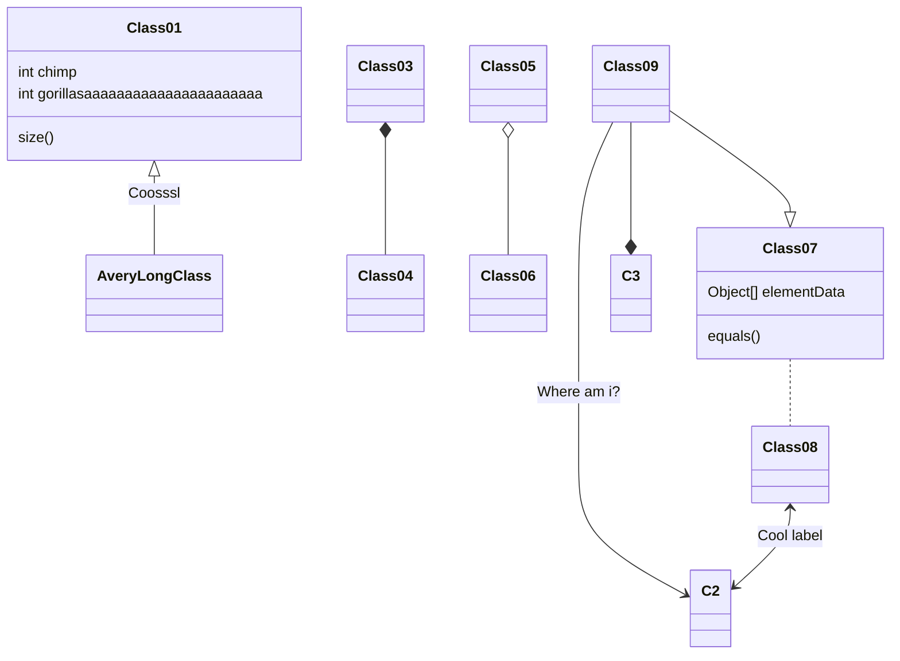
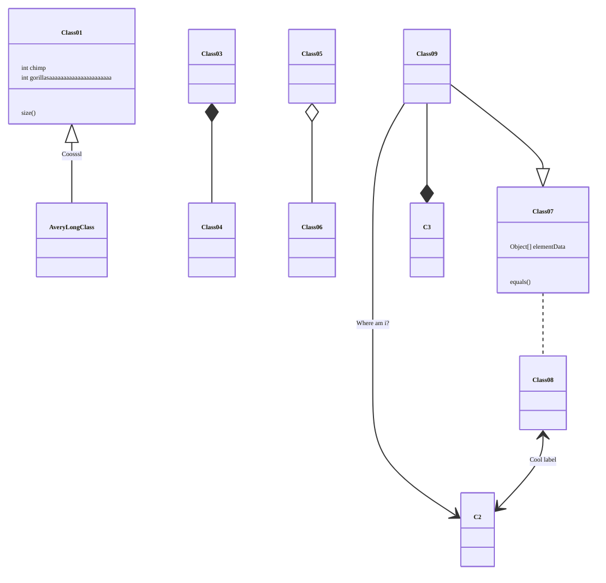
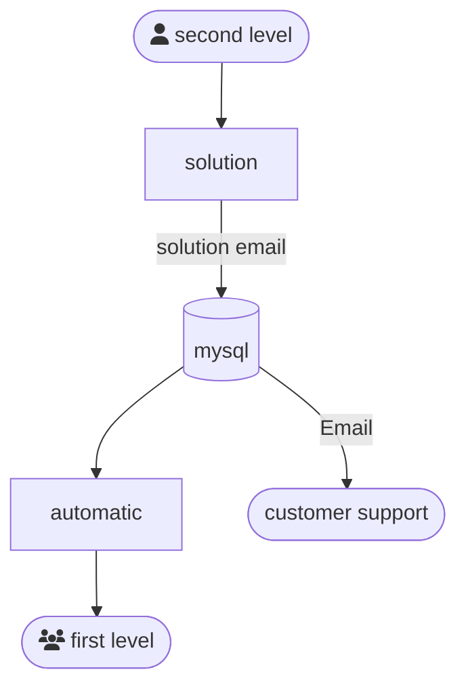
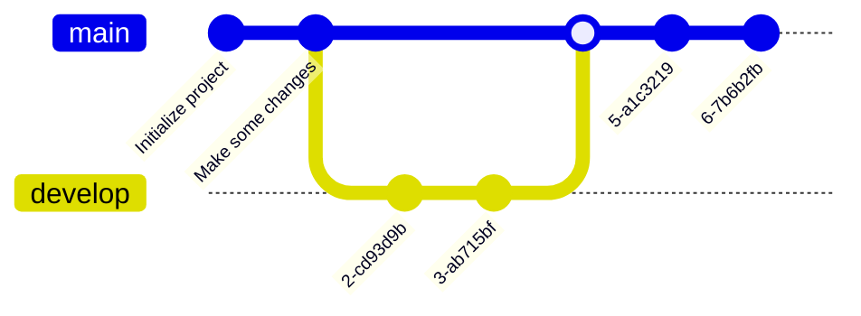

+++

title = "Reproducible experiments or didn't happen"
description = "The replicability crisis and recipes for self-organizing systems"
outputs = ["Reveal"]
aliases = [
    "/guide/"
]

+++

# PhD forum talk @ ACSOS 2024

#### {}
## [Danilo Pianini](mailto:danilo.pianini@unibo.it)
### Alma Mater Studiorum -- Università di Bologna

---


<br><br><br><br><br><br><br><br><br><br><br><br><br><br><br><br><br><br><br><br><br><br><br>

<!-- white background -->
<span style="background-color: white; border-radius: 0.2em;">
source: https://www.earth.com/news/hippopotamus-population-hit-hard-by-habitat-destruction

</span>

---

# Hippos (Hippopotamus amphibius) facts

* {}
* {}
* {}
* {}
* {}

---

I'm now making a claim, and I want to see if you believe me

{}
# An adult hippo's bite can crush in half an adult crocodile

Please *raise your hand if you believe this claim*
{}

{}


Please raise your hand if you believe this claim *now*
{}

---


---

Let's do the same game

{}
# It is possible to tame and ride a hippo

Please *raise your hand if you believe this claim*
{}

{}


Please raise your hand if you believe this claim *now*
{}

{}
Would it be more convincing if I precisely explained how the hippo was tamed and ridden?
{}

{}
Would it be more convincing if multiple independent people applied the same procedure and obtained the same result?
{}

---

# ~~Picture~~ Reproducible experiments, or didn't happen


---


---

## Replication crisis
### aka replicability crisis or reproducibility crisis

* ongoing *methodological crisis*
* the results of many scientific studies are hard or impossible to *reproduce*.

* empirical reproductions are essential for the the scientific method

#### no reproducibility $\Rightarrow$ scientific credibility is undermined

---

## People working in computer science are lucky!
#### (on average)

* It's the only engineering discipline producing *mass-less* artifacts
    * Much easier to *share*
* Even if we work in highly unpredictable contexts, we can *control randomness* in many experiments
    * Much easier to *reproduce*
* We have support tools to *track changes*, *automate*, and *manage* complexity
    * Much easier to *maintain*

---

## Three pillars

### Availability

Let others *access* your work

### Reproducibility / Maintenance

If it is an **experiment**, make sure others can *obtain the same results* of yours

If it is a **tool** make sure your work is *sustainable* over time

### Reusability

Let others *build upon* your work

---

## Availability


---


### Specifically for data science and computer science

* Make your artifacts *available*
  * Share code as open source (**licensing**)
  * Share code and data where people will find it (**GitHub**)
  * Share code and data where it will be archived for the foreseeable future (**Zenodo**)
* Make your artifacts *reproducible*
  * It works on your PC? Ship your PC! (**containerization**)
* Make your artifacts *maintainable*
  * Be ready to accept contributions and work in team (**version control**)
  * Always check that the software is working (**continuous integration**)
* Make your artifacts *reusable*
  * document them appropriately (**GitHub Pages**)

---

* Also please don't mess around with hippos

# Short guide to Markdown slides

---

# Headers

# H1
## H2
### H3
#### H4

---

# Text

normal text

`inline code`

*italic*

**bold**

**_emphasized_**

*__emphasized alternative__*

~~strikethrough~~

[link](http://www.google.com)

---

# Lists and enums

1. First ordered list item
1. Another item
    * Unordered sub-list.
    * with two items
        * another sublist
            1. With a sub-enum
            1. yay!
1. Actual numbers don't matter, just that it's a number
  1. Ordered sub-list
1. And another item.

---

# Inline images


---

## Fallback to shortcodes for resizing

Autoresize specifying

* `max-w` (percent of parent element width) and/or `max-h` (percent of viewport height) as max sizes , and
* `width` and/or `height` as *exact* sizes (as percent of viewport size)



---

## Multi-column slide

{}{}
Column 1
{}{}
Column 2
{}{}

---

## Tick and Cross

{} This is something good {}
{} This is something good {}

---

## Chart.js


{
    type: 'bar',
    data: {
        labels: ['Red', 'Blue', 'Yellow', 'Green', 'Purple', 'Orange'],
        datasets: [{
            label: 'Bar Chart',
            data: [12, 19, 18, 16, 13, 14],
            backgroundColor: [
                'rgba(255, 99, 132, 0.2)',
                'rgba(54, 162, 235, 0.2)',
                'rgba(255, 206, 86, 0.2)',
                'rgba(75, 192, 192, 0.2)',
                'rgba(153, 102, 255, 0.2)',
                'rgba(255, 159, 64, 0.2)'
            ],
            borderColor: [
                'rgba(255, 99, 132, 1)',
                'rgba(54, 162, 235, 1)',
                'rgba(255, 206, 86, 1)',
                'rgba(75, 192, 192, 1)',
                'rgba(153, 102, 255, 1)',
                'rgba(255, 159, 64, 1)'
            ],
            borderWidth: 1
        }]
    },
    options: {
        maintainAspectRatio: false,
        scales: {
            yAxes: [{
                ticks: {
                    beginAtZero: true
                }
            }]
        }
    }
}


---

## FontAwesome

<i class="fa-solid fa-mug-hot"></i>
<i class="fa-solid fa-lemon"></i>
<i class="fa-solid fa-flask"></i>
<i class="fa-solid fa-apple-whole"></i>
<i class="fa-solid fa-bacon"></i>
<i class="fa-solid fa-beer-mug-empty"></i>
<i class="fa-solid fa-pepper-hot"></i>

---

## Bootstrap 1

<div class="card w-100" >
  
  <div class="card-body">
    <h5 class="card-title">Card title</h5>
    <p class="card-text">Some quick example text to build on the card title and make up the bulk of the card's content.</p>
    <a href="#" class="btn btn-primary">Go somewhere</a>
  </div>
</div>

---

## Bootstrap 2

<button type="button" class="btn btn-primary">Primary</button>
<button type="button" class="btn btn-secondary">Secondary</button>
<button type="button" class="btn btn-success">Success</button>
<button type="button" class="btn btn-danger">Danger</button>
<button type="button" class="btn btn-warning">Warning</button>
<button type="button" class="btn btn-info">Info</button>
<button type="button" class="btn btn-light">Light</button>
<button type="button" class="btn btn-dark">Dark</button>

<button type="button" class="btn btn-link">Link</button>

---

## Low res, plain markdown


---

## Hi res, plain markdown


---

## Low res, default



---

## Hi res, default



---

## Low res, enlarged horizontally



---

## Low res, enlarged vertically



---

## Hi res, reduced horizontally



---

## Hi res, reduced vertically



---

## Hi res, reducing maximum expansion horizontally



---

## Hi res, reducing maximum expansion vertically



---



# Large images as background
## (May affect printing)

---



# Also available with blur and custom transitions
## (May affect printing)

---

# $$\LaTeX{}$$


Inline equations like $E=mc^2$

$$\frac{n!}{k!(n-k)!} = \binom{n}{k}$$

---

# Code snippets


```kotlin
val x = pippo
```

```go
package main

import "fmt"

func main() {
    fmt.Println("Hello world!")
}
```

---

# Tables

Colons can be used to align columns.

| Tables        | Are           | Cool  |
| ------------- |:-------------:| -----:|
| col 3 is      | right-aligned | $1600 |
| col 2 is      | centered      |   $12 |
| zebra stripes | are neat      |    $1 |

There must be at least 3 dashes separating each header cell.
The outer pipes (|) are optional, and you don't need to make the
raw Markdown line up prettily. You can also use inline Markdown.

---

# Quotes

> Multiple
> lines
> of
> a
> single
> quote
> get
> joined

> Very long one liners of Markdown text automatically get broken into a multiline quotation, which is then rendered in the slides.

---

# Fragments

* 
* 
* 

---

# Graphs via Gravizo


  digraph G {
    aize ="4,4";
    main [shape=box];
    main -> parse [weight=8];
    parse -> execute;
    main -> init [style=dotted];
    main -> cleanup;
    execute -> { make_string; printf}
    init -> make_string;
    edge [color=red];
    main -> printf [style=bold,label="100 times"];
    make_string [label="make a string"];
    node [shape=box,style=filled,color=".7 .3 1.0"];
    execute -> compare;
  }


---

# Graphs via mermaid.js



---


# Graphs via mermaid.js with options




---
# Graphs via mermaid.js 2



---

# Graphs via mermaid.js 3



---

# Keystrokes

<kbd>Ctrl</kbd> + <kbd>Alt</kbd> + <kbd>Del</kbd>

---

# Import shared slides

<!-- write-here "shared-slides/devops/devops-intro.md" -->
<!-- end-write -->
